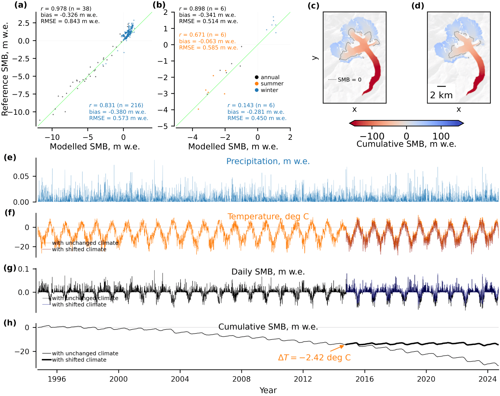

# GlaUnTI: GLAcier-UNiversal Temperature Index model

[Konstantin A. Maslov](https://people.utwente.nl/k.a.maslov), [Thomas Schellenberger](https://www.mn.uio.no/geo/english/people/aca/geohyd/thosche/), [Claudio Persello](https://people.utwente.nl/c.persello), [Alfred Stein](https://people.utwente.nl/a.stein)

[[`Paper`]()] [[`Dataset`](#dataset)] [[`BibTeX`](#citing)] 

<br/>



Glacier surface mass balance (SMB) is a key climate indicator and a central driver of glacier change. 
Direct SMB observations remain sparse and unevenly distributed.
Hence, transferable SMB models are essential for large-scale assessments and projections. 
Here, we propose the GLAcier-UNiversal Temperature Index model (GlaUnTI) for this purpose. 
This hybrid physics-machine learning model modifies a fully differentiable temperature index (TI) SMB model by introducing a shallow convolutional neural corrector. 
It learns spatially and temporally varying adjustments to a small set of physically interpretable TI parameters, using glacier geometry and aggregated climate information. 
We calibrate four models&mdash;a basic TI model, a purely data-driven recurrent neural network with no physical inductive bias and two GlaUnTI variants, with and without glacier facies maps as predictors&mdash;using a dataset of 65 European glaciers spanning 1995&ndash;2024 and covering the Alps, Scandinavia, Iceland, Svalbard and the Pyrenees. 
Their performance is evaluated on a spatially independent test subset of 13 glaciers across heterogeneous regions. 
The evaluation uses 793/756/314 (annual/winter/summer) point SMB measurements and 312/235/233 glacier-wide SMB estimates. 
On the test glaciers, the baseline TI model achieves annual point-level performance with *r* = 0.854 and an RMSE equal to 1.707 m w.e. 
With GlaUnTI, *r* increases to 0.940 and the RMSE reduces to 1.068 m w.e. 
At the glacier-wide scale, the baseline TI model attains an *r* equal to 0.606 and an RMSE of 0.805 m w.e. 
With GlaUnTI, *r* increases to 0.700 and the RMSE reduces to 0.627 m w.e. 
Including glacier facies maps from the end of the ablation season to the corrector yields moderate benefits in glacier-wide summer (11.0%) and annual (12.2%) SMB estimates. 
We found that the purely data-driven baseline model overall shows the weakest spatial transferability. 
Also, end-to-end differentiability enables efficient gradient-based calibration, transfer learning, inverse optimisation of effective forcing perturbations, formal model explainability and propagation of forcing-driven aleatoric uncertainty through long SMB trajectories. 
These results demonstrate that parameter-corrected hybrid models improve SMB transferability across diverse climate regimes while preserving a physically grounded structure, suitable for integration into broader glacier evolution workflows and for informing climate-related policies. 

<br/>

## Dataset

The dataset is available at [https://doi.org/10.4121/5ea53bc3-2c85-42bb-89d1-606c8ed1d80a](https://doi.org/10.4121/5ea53bc3-2c85-42bb-89d1-606c8ed1d80a). 
Download, unzip and place it in a separate folder. 
Adjust `data_folder = ...` in `constants.py` accordingly to proceed. 


## Getting started

### Repository layout

- `glaunti/`&mdash;model definitions (TI, GRU, GlaUnTI)
- `core/`&mdash;loss functions and training utilities
- `dataloader/`&mdash;dataset IO, feature construction, caching/prefetching
- `train_a.py`, `train_b.py`, `train_c.py`, `train_d.py`&mdash;training scripts for Models A&ndash;D
- `infer_and_evaluate.py`&mdash;inference + evaluation for a selected glacier/model
- `finetune.py`&mdash;per-glacier finetuning/transfer learning (TI model)
- `inverse_modelling.ipynb`, `xai.ipynb`, `aleatoric_uq.ipynb`&mdash;illustrative examples enabled by end-to-end differentiability
- `params/`&mdash;saved parameter pytrees (`.eqx`) (pretrained weights and/or training outputs)
- `logs/`&mdash;training logs (`.csv`)

> Tip: run scripts from the **repository root** (imports assume this working directory).

<br/>

The repository includes four calibrated model variants used in the manuscript:
- **Model A**&mdash;Basic autodiff-friendly **TI** model  
- **Model B**&mdash;Purely data-driven **GRU** baseline  
- **Model C**&mdash;**GlaUnTI without glacier facies** (facies channels replaced by a placeholder)  
- **Model D**&mdash;**GlaUnTI with facies** (uses end-of-ablation-season facies maps where available)


### Installation

We recommend using the [Anaconda](https://www.anaconda.com/download) or [Miniconda](https://docs.conda.io/projects/miniconda/en/latest/) Python distributions. 
After installing one of them, create the environment from `env.yml`:
```
conda env create -f env.yml
conda activate massive-jax
```

Notes:
- `env.yml` is configured for a CUDA-enabled `jaxlib` build. If you do not use CUDA, **manually** install dependencies for your preferred build (e.g. CPU or Metal)
- NetCDF reading/writing uses the `netcdf4` engine via `xarray`


### Running scripts

Training scripts write best parameters to `params/<model>.eqx` and training logs to `logs/<model>.csv`.
Run in this order to train the whole suite of models from scratch:
```
python train_a.py
python train_b.py
python train_c.py
python train_d.py
```
> Models C and D depend on the availability of `params/a.eqx` and `params/c.eqx`, respectively.

<br/>

`finetune.py` finetunes Model A on a single glacier (useful for transfer-learning experiments and is used in the notebooks):
The usage is as follows:
```
usage: finetune.py [-h] [--init_params_path INIT_PARAMS_PATH] [--final_params_path FINAL_PARAMS_PATH] [--log_path LOG_PATH] glacier

positional arguments:
  glacier               Glacier name

options:
  -h, --help            show this help message and exit
  --init_params_path INIT_PARAMS_PATH
                        Init params path (.eqx)
  --final_params_path FINAL_PARAMS_PATH
                        Final params path (.eqx)
  --log_path LOG_PATH   Log path (.csv)
```

<br/>

Use `infer_and_evaluate.py` to run a model for one glacier and produce daily SMB outputs (`.nc`) as well as an evaluation summary (`.json`). 
The usage is as follows:
```
usage: infer_and_evaluate.py [-h] [--params_path PARAMS_PATH] [--unfreeze_ti] {a,b,c,d} glacier smb_path eval_path

positional arguments:
  {a,b,c,d}             Model name
  glacier               Glacier name
  smb_path              Output SMB path (.nc)
  eval_path             Output evaluation path (.json)

options:
  -h, --help            show this help message and exit
  --params_path PARAMS_PATH
                        Params path (.eqx)
  --unfreeze_ti         Load with unfrozen TI params (e.g. for finetuned models)
```


### Notebooks 

The repository provides three notebooks with illustrative examples enabled by end-to-end differentiability (described in Appendix A of the manuscript):
- [inverse_modelling.ipynb](inverse_modelling.ipynb)&mdash;gradient-based inverse optimisation of effective forcing perturbations
- [xai.ipynb](xai.ipynb)&mdash;model explainability/input attribution
- [aleatoric_uq.ipynb](aleatoric_uq.ipynb)&mdash;first-order propagation of forcing-driven aleatoric uncertainty along SMB trajectories


### DEM imputation

Data-driven imputation of elevation voids (described in Appendix B of the manuscript) is deposited in [a separate repository](https://github.com/konstantin-a-maslov/demimputation).


## License

This software is licensed under the [GNU General Public License v2](LICENSE).


## Citing

To cite the paper/repository, please use the following bib entry. 

```
@article{
  ... COMING SOON ...
}
```
